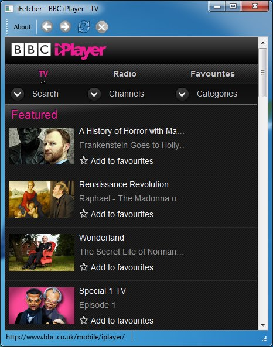
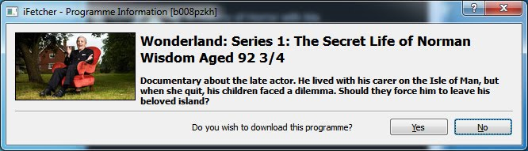

# iFetcher: the visual iPlayer downloader

>---
>
>**NOTE**: In early December 2010, the BBC changed the way it serves content to the iPhone/iPod to use an HTTPS connection for part of the process. As a result this program no longer works.  More information on the nature of the change can be found [here](here).
>
>---

iFetcher is a small utility written in C++/[Qt](https://www.qt.io/) that allows you to download unencrypted [BBC iPlayer](https://www.bbc.co.uk/iplayer) TV programmes to your local hard disk for later viewing.  This utility is particularly useful if your broadband connection is too slow to support video streaming. Downloaded TV programmes can be transferred to an [iPod](https://www.apple.com/ipod-touch/) or [iPhone](https://www.apple.com/iphone/) using [iTunes](https://www.apple.com/itunes/).

The utility program works by pretending to be an iPhone so only video material available for the iPod/iPhone can be downloaded.  In addition to this, the program is only usable in the UK since the BBC will check your IP address.  Please note that the links may not always work as programmes may not be available for any number of reasons.

To download a TV programme click on a programme link in the web page displayed in the main window and wait a moment for a new windows containing the program details will appear on screen.  Press the yes button on the new window to select the location where you wish to save the programme and commence the download.

For an overview of the video request process used in this program please visit the [iPhone H.264 video page](iPhone H.264 video page) at the [Beeb hack website](Beeb hack website).

Cross-platform source code and 64 bit Microsoft Windows 7 binary are available from the release page. The source code has been released under the version 3 of the GNU general public license.
